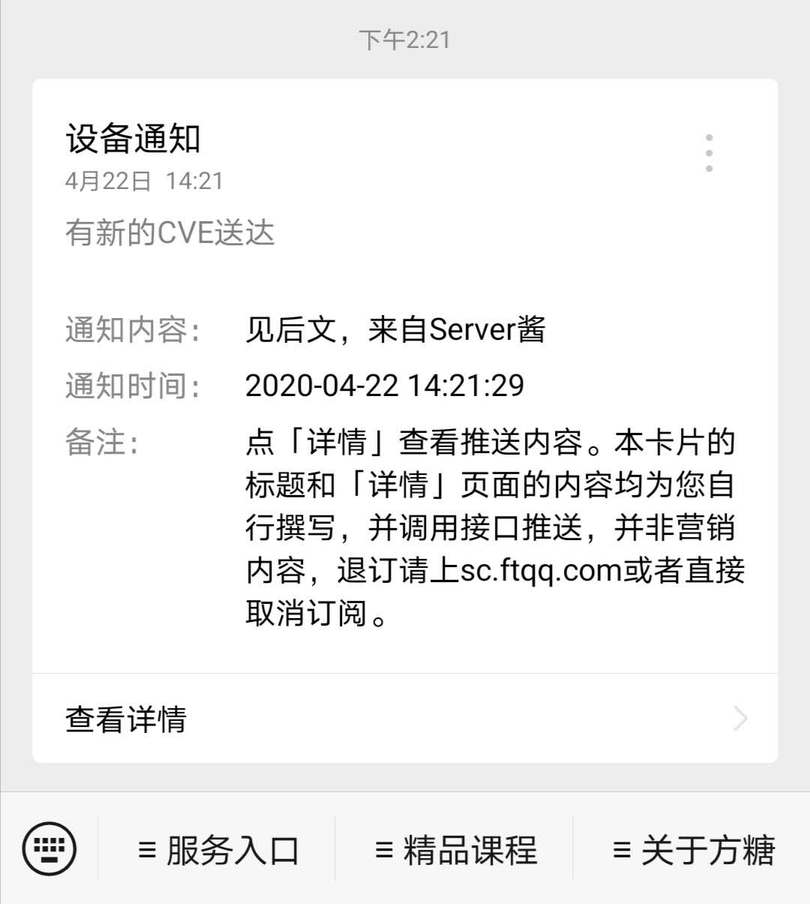

# Github-Monitor
## 对github新CVE，0DAY，RCE等的监控并推送到微信
-----------------
这个是在大神 洛米唯熊 脚本基础上改的，他用了itchat给微信推信息。
我改成了Server酱，简单一点，效果差不多。
注意：要把34行的KEY换成自己的Server酱KEY。如果你不知道Server酱是什么，请移步
http://sc.ftqq.com

